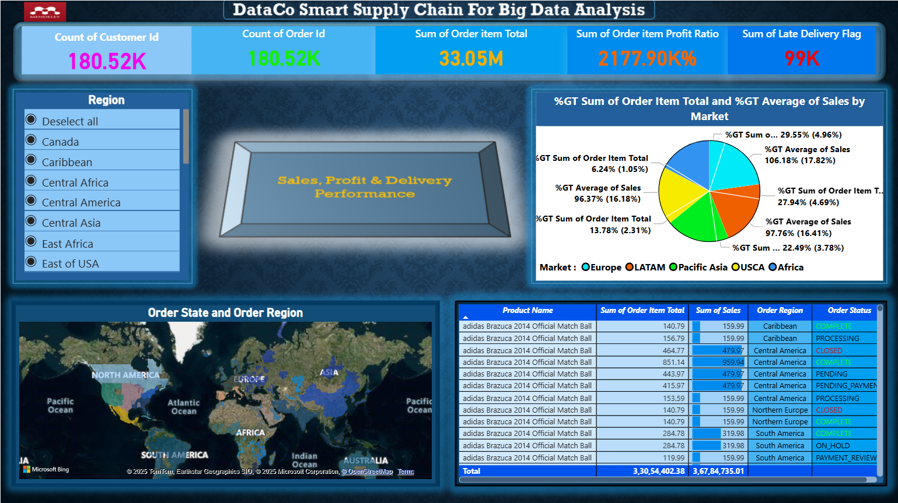

# DataCo Smart Supply Chain -- Power BI Dashboard

A Power BI dashboard built using the **DataCo Smart Supply Chain
Dataset** to analyze sales, profit, order activity, delivery
performance, markets, and regional distribution.

The dashboard is designed to provide a single-page overview of
supply-chain performance with KPI cards, interactive region filtering,
market analysis, geographic visualization, and detailed order-level
data.

## Dashboard Preview


------------------------------------------------------------------------

## 1. Project Overview

The objective of this project is to transform the DataCo Smart Supply
Chain dataset into an interactive Power BI dashboard that helps users
understand:

-   Total number of customers
-   Total number of orders
-   Total order-item revenue
-   Profit-ratio performance
-   Late-delivery activity
-   Sales performance by market
-   Geographic distribution of orders
-   Order status and regional performance
-   Product-level sales and order information

The dashboard uses Power BI for data cleaning, modeling, DAX
calculations, interactive filtering, and visualization.

------------------------------------------------------------------------

## 2. Dataset

**Dataset:** DataCo Smart Supply Chain Dataset

The dataset contains information related to customers, orders, products,
markets, regions, sales, profit, shipping, and delivery status.

### Important fields used in this dashboard

Depending on the version of the DataCo dataset, column names may appear
with slightly different capitalization or underscores.

  -----------------------------------------------------------------------
  Field                               Purpose
  ----------------------------------- -----------------------------------
  `Customer Id`                       Identifies customers

  `Order Id`                          Identifies orders

  `Order Item Total`                  Revenue/value associated with an
                                      order item

  `Sales`                             Sales amount

  `Order Item Profit Ratio`           Profit ratio for an order item

  `Late_delivery_risk` /              Indicates
  `Late Delivery Flag`                delivery-risk/late-delivery
                                      information

  `Order Region`                      Geographic order region

  `Market`                            Market such as Europe, LATAM,
                                      Pacific Asia, USCA, Africa

  `Order Status`                      Current status of an order

  `Product Name`                      Product purchased

  `Order Date`                        Date of the order

  `Shipping Date`                     Shipping-related date

  `Category Name`                     Product category

  `Department Name`                   Product department
  -----------------------------------------------------------------------

------------------------------------------------------------------------

## 3. Tools & Technologies

-   **Microsoft Power BI Desktop**
-   **Power Query** -- data cleaning and transformation
-   **DAX** -- calculated measures and KPIs
-   **Power BI Map/Azure Maps/Bing Maps** -- geographic visualization
-   **DataCo Smart Supply Chain Dataset**
-   **GitHub** -- project documentation and version control

------------------------------------------------------------------------

# 4. Dashboard Structure

The dashboard contains the following major sections:

### KPI Cards

The top section contains five major KPI cards:

1.  **Count of Customer ID**
2.  **Count of Order ID**
3.  **Sum of Order Item Total**
4.  **Sum of Order Item Profit Ratio**
5.  **Sum of Late Delivery Flag**

These provide an immediate overview of the dataset.

### Region Slicer

An interactive **Region** slicer is provided on the left side of the
dashboard.

Selecting a region dynamically filters the other visuals.

### Market Analysis

A pie/donut chart is used to compare market-level contributions using:

-   Order Item Total
-   Average Sales

Markets include categories such as:

-   Europe
-   LATAM
-   Pacific Asia
-   USCA
-   Africa

### Geographic Analysis

A map visual shows the distribution of orders across different
geographic regions.

### Detailed Order Table

A table visual provides detailed information including:

-   Product Name
-   Order Item Total
-   Sales
-   Order Region
-   Order Status

This allows users to move from high-level KPIs to individual order-level
information.

------------------------------------------------------------------------

# 5. Data Import

## Step 1 -- Open Power BI Desktop

Open **Power BI Desktop**.

Select:

**Home → Get Data → Text/CSV**

Select the DataCo Smart Supply Chain CSV file.

Click **Transform Data** to open Power Query.

------------------------------------------------------------------------

# 6. Data Cleaning in Power Query

Before creating visuals, clean and prepare the dataset.

Recommended transformations:

### Remove unnecessary columns

Remove columns that are not required for the dashboard if they increase
model size unnecessarily.

### Change data types

Make sure:

-   IDs → Text or Whole Number
-   Sales → Decimal Number
-   Order Item Total → Decimal Number
-   Order Item Profit Ratio → Decimal Number
-   Dates → Date/DateTime
-   Delivery flag/risk → Whole Number or appropriate categorical type

### Handle null values

Check important columns for blank or null values.

For example:

-   Customer ID
-   Order ID
-   Sales
-   Order Item Total
-   Order Region
-   Market
-   Order Status

### Rename columns

Use clear and consistent names where required.

For example:

``` text
Order Item Total
Order Item Profit Ratio
Order Region
Order Status
```

Click:

**Home → Close & Apply**

to load the cleaned data into Power BI.

------------------------------------------------------------------------

# 7. DAX Measures

Create the following measures from:

**Modeling → New Measure**

## Total Customers

``` dax
Total Customers =
DISTINCTCOUNT('DataCo'[Customer Id])
```

If you want to reproduce the screenshot's exact **Count of Customer Id**
behavior instead of unique customers:

``` dax
Customer ID Count =
COUNT('DataCo'[Customer Id])
```

------------------------------------------------------------------------

## Total Orders

For unique orders:

``` dax
Total Orders =
DISTINCTCOUNT('DataCo'[Order Id])
```

To reproduce a simple row/ID count:

``` dax
Order ID Count =
COUNT('DataCo'[Order Id])
```

------------------------------------------------------------------------

## Total Order Item Value

``` dax
Total Order Item Value =
SUM('DataCo'[Order Item Total])
```

------------------------------------------------------------------------

## Total Sales

``` dax
Total Sales =
SUM('DataCo'[Sales])
```

------------------------------------------------------------------------

## Average Sales

``` dax
Average Sales =
AVERAGE('DataCo'[Sales])
```

------------------------------------------------------------------------

## Average Profit Ratio

Averages are generally more meaningful than simply adding individual
ratios:

``` dax
Average Profit Ratio =
AVERAGE('DataCo'[Order Item Profit Ratio])
```

If the dataset stores the ratio as a decimal, format this measure as
**Percentage**.

------------------------------------------------------------------------

## Sum of Profit Ratio

If the objective is specifically to reproduce the metric shown in the
reference dashboard:

``` dax
Sum Profit Ratio =
SUM('DataCo'[Order Item Profit Ratio])
```

Format it according to how the source field is stored.

> Note: Summing individual profit ratios can produce a very large
> percentage and is not the same as calculating overall profit margin.
> Use an average or a profit/revenue ratio when the goal is an
> interpretable business metric.

------------------------------------------------------------------------

## Late Delivery Count

If the dataset contains a binary late-delivery field where `1` means
late/risk:

``` dax
Late Delivery Count =
CALCULATE(
    COUNTROWS('DataCo'),
    'DataCo'[Late_delivery_risk] = 1
)
```

If the field has already been transformed into a `Late Delivery Flag`
column:

``` dax
Late Delivery Count =
SUM('DataCo'[Late Delivery Flag])
```

------------------------------------------------------------------------

## Late Delivery Percentage

``` dax
Late Delivery % =
DIVIDE(
    [Late Delivery Count],
    COUNTROWS('DataCo'),
    0
)
```

Format as **Percentage**.

------------------------------------------------------------------------

# 8. Creating the KPI Cards

Add five **Card** visuals.

### Card 1 -- Customers

Field:

``` text
Total Customers
```

### Card 2 -- Orders

Field:

``` text
Total Orders
```

### Card 3 -- Order Item Total

Field:

``` text
Total Order Item Value
```

### Card 4 -- Profit Ratio

Field:

``` text
Average Profit Ratio
```

or use `Sum Profit Ratio` if reproducing the reference dashboard.

### Card 5 -- Late Deliveries

Field:

``` text
Late Delivery Count
```

Arrange the cards horizontally at the top of the report.

------------------------------------------------------------------------

# 9. Region Slicer

Add a **Slicer** visual.

Drag:

``` text
Order Region
```

into the slicer.

Set the slicer to a vertical/list format.

Enable:

-   Search if required
-   Single-select or multi-select depending on the project requirement

The slicer should filter the other visuals on the page.

------------------------------------------------------------------------

# 10. Market Analysis Chart

Create a **Pie Chart** or **Donut Chart**.

### Legend

``` text
Market
```

### Values

You can use:

``` text
Total Order Item Value
```

For an additional comparison, create another visual using:

``` text
Average Sales
```

This provides a market-level view of sales and order-value contribution.

------------------------------------------------------------------------

# 11. Market Contribution Percentage

To calculate the percentage contribution of each market:

``` dax
Market Order Value % =
DIVIDE(
    [Total Order Item Value],
    CALCULATE(
        [Total Order Item Value],
        ALL('DataCo'[Market])
    ),
    0
)
```

Format as **Percentage**.

This measure can be used in tooltips or labels.

------------------------------------------------------------------------

# 12. Geographic Map

Add a **Map**, **Azure Maps**, or another supported Power BI map visual.

Use:

``` text
Order Region
```

as the geographic field.

Recommended fields:

-   Location → `Order Region`
-   Size → `Total Order Item Value`
-   Tooltips → `Total Sales`, `Total Orders`, `Late Delivery Count`

If latitude and longitude fields are available in the dataset, using
them can improve geographic accuracy.

------------------------------------------------------------------------

# 13. Detailed Order Table

Add a **Table** visual.

Use the following fields:

``` text
Product Name
Order Item Total
Sales
Order Region
Order Status
```

Optional additional fields:

``` text
Order Id
Customer Id
Market
Order Date
Shipping Date
Category Name
```

### Formatting

Use:

-   Alternating row colors
-   Currency/decimal formatting for monetary values
-   Conditional formatting for order status
-   Data bars for Sales or Order Item Total

------------------------------------------------------------------------

# 14. Conditional Formatting

For the `Order Status` column, conditional formatting can be used to
make statuses easier to identify.

Example categories:

``` text
COMPLETE
PENDING
PROCESSING
CLOSED
CANCELED
SUSPECTED_FRAUD
```

You can use different font/background formatting for each status.

For numerical columns such as `Sales` and `Order Item Total`, use:

**Conditional formatting → Data bars**

to visually compare values.

------------------------------------------------------------------------

# 15. Dashboard Theme

The reference dashboard uses a dark blue/blue supply-chain style.

Suggested design:

### Background

Dark navy/blue background.

### KPI Cards

Use blue gradient-style cards with high-contrast KPI numbers.

### Titles

Use white text.

### Accent Colors

Use contrasting colors for:

-   Revenue
-   Profit
-   Delivery
-   Markets
-   Order status

### Layout

Recommended arrangement:

``` text
---------------------------------------------------------
|                  DASHBOARD TITLE                      |
---------------------------------------------------------
| KPI 1 | KPI 2 | KPI 3 | KPI 4 | KPI 5 |
---------------------------------------------------------
| Region Slicer |      Market Analysis                  |
|               |                                      |
---------------------------------------------------------
| Geographic Map             | Detailed Order Table     |
|                            |                         |
---------------------------------------------------------
```

------------------------------------------------------------------------

# 16. Recommended Page Title

Use:

``` text
DataCo Smart Supply Chain for Big Data Analysis
```

Alternative:

``` text
DataCo Smart Supply Chain – Sales, Profit & Delivery Performance
```

------------------------------------------------------------------------

# 17. Interactivity

The dashboard should support interactive analysis.

Users should be able to:

-   Select a region
-   View market-specific performance
-   Explore order regions
-   Inspect product-level sales
-   Analyze order status
-   Compare sales and order-item value
-   Filter the entire dashboard dynamically

Use:

**Format → Edit Interactions**

to verify that slicers and charts interact correctly.

------------------------------------------------------------------------

# 18. Optional Date Analysis

For time-based analysis, create a dedicated Date table.

``` dax
Date Table =
CALENDAR(
    MIN('DataCo'[Order Date]),
    MAX('DataCo'[Order Date])
)
```

Add calculated columns:

``` dax
Year =
YEAR('Date Table'[Date])
```

``` dax
Month =
FORMAT('Date Table'[Date], "MMM")
```

``` dax
Month Number =
MONTH('Date Table'[Date])
```

``` dax
Year Month =
FORMAT('Date Table'[Date], "YYYY-MM")
```

Then create a relationship between:

``` text
Date Table[Date]
```

and

``` text
DataCo[Order Date]
```

This can be used to create:

-   Monthly sales trends
-   Yearly sales trends
-   Monthly order volume
-   Delivery trends over time

------------------------------------------------------------------------

# 19. Useful Additional Measures

## Total Profit

If the dataset contains a profit column:

``` dax
Total Profit =
SUM('DataCo'[Order Profit Per Order])
```

## Profit Margin

``` dax
Profit Margin % =
DIVIDE(
    [Total Profit],
    [Total Sales],
    0
)
```

Format as Percentage.

## Orders by Region

``` dax
Orders by Region =
DISTINCTCOUNT('DataCo'[Order Id])
```

Use `Order Region` as the category/axis.

## Sales by Market

``` dax
Sales by Market =
[Total Sales]
```

Use `Market` as the category/legend.

------------------------------------------------------------------------

# 20. Data Model

For a simple project, the cleaned DataCo table can be used as the
primary fact table.

For a more advanced implementation, a star schema can be created:

``` text
                 Date
                  |
                  |
Customer ---- Sales/Orders ---- Product
                  |
                  |
                Market
                  |
                Region
```

Possible dimensions:

-   DimDate
-   DimCustomer
-   DimProduct
-   DimMarket
-   DimRegion

Fact table:

-   FactOrders / FactOrderItems

A star schema can improve organization, scalability, and DAX
performance.

------------------------------------------------------------------------

# 21. Key Insights the Dashboard Can Provide

The dashboard can be used to investigate questions such as:

1.  How many customers and orders are present?
2.  What is the total order-item value?
3.  Which markets contribute the most sales?
4.  Which regions generate the highest order activity?
5.  How many orders have late-delivery risk?
6.  Which products generate high sales?
7.  Which order statuses occur most frequently?
8.  How does sales performance vary across markets?
9.  Which regions require further delivery-performance investigation?
10. How does sales or order volume change over time?

These are analytical questions; the dashboard should be used to derive
the actual values from the current filtered dataset.

------------------------------------------------------------------------

# 22. Power BI Build Workflow

The complete workflow is:

``` text
DataCo Dataset
      ↓
Import CSV into Power BI
      ↓
Power Query
      ↓
Clean & Transform Data
      ↓
Set Data Types
      ↓
Create Relationships / Date Table
      ↓
Create DAX Measures
      ↓
Create KPI Cards
      ↓
Create Region Slicer
      ↓
Create Market Chart
      ↓
Create Geographic Map
      ↓
Create Detailed Order Table
      ↓
Apply Formatting
      ↓
Add Interactions
      ↓
Test Filters
      ↓
Publish Dashboard
```

------------------------------------------------------------------------

# 23. Validation Checklist

Before publishing the report, verify:

-   [ ] Dataset imported successfully
-   [ ] Important columns have correct data types
-   [ ] Null values were reviewed
-   [ ] Customer and order counts are correct
-   [ ] Sales totals match the source data
-   [ ] Order Item Total is correctly aggregated
-   [ ] Profit ratio is formatted correctly
-   [ ] Late-delivery calculation is correct
-   [ ] Region slicer filters all required visuals
-   [ ] Market chart displays correct categories
-   [ ] Map fields are geographically recognized
-   [ ] Table displays correct product/order information
-   [ ] Conditional formatting works
-   [ ] Dashboard layout is readable
-   [ ] All visual interactions have been tested

------------------------------------------------------------------------

# 24. Project Outcome

This project demonstrates how Power BI can be used to convert a large
supply-chain dataset into an interactive business intelligence
dashboard.

The final dashboard combines:

**Data Cleaning + DAX + KPI Analysis + Market Analysis + Geographic
Visualization + Interactive Filtering + Detailed Order Analysis**

to provide a consolidated view of supply-chain performance.

------------------------------------------------------------------------

## Author

**Swamy Hyma Kumar Vechalapu**

B.Tech -- Computer Science and Engineering (Data Science)

Tools: **Power BI \| Power Query \| DAX \| SQL \| Python \| Data
Analysis**

------------------------------------------------------------------------

## License

This project is intended for educational, portfolio, and data-analytics
demonstration purposes. Dataset ownership and licensing remain with the
original dataset provider.
